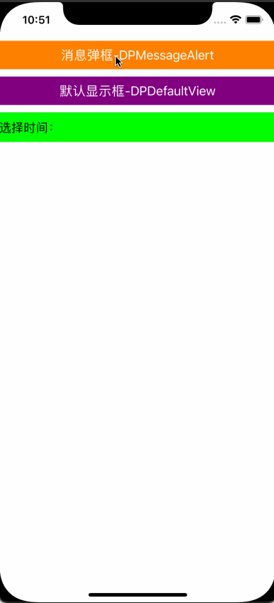

<p align="center" >

</p>

## Features

-  An UIButton custom class

## Requirements
- iOS 7.0 or later
- tvOS 9.0 or later
- watchOS 2.0 or later
- OS X 10.8 or later
- Xcode 8.0 or later

## Getting Started
- Read this Readme doc
- Read the [How to use section](https://github.com/xiayuqingfeng/DPWidgetSum#how-to-use)
- Read the [documentation @ CocoaDocs](https://cocoapods.org/pods/DPWidgetSum)
- Try the example by downloading the project from Github or even easier using CocoaPods try `pod try DPWidgetSum`
- Get to the [installation steps](https://github.com/rs/DPWidgetSum#installation)

## Who Uses It
- Find out [who uses DPWidgetSum](https://github.com/xiayuqingfeng/DPWidgetSum/wiki/Who-Uses-DPWidgetSum) and add your app to the list.

## Communication
- If you **need help**, use [Stack Overflow](http://stackoverflow.com/questions/tagged/DPWidgetSum). (Tag 'DPWidgetSum')
- If you'd like to **ask a general question**, use [Stack Overflow](http://stackoverflow.com/questions/tagged/DPWidgetSum).
- If you **found a bug**, open an issue.
- If you **have a feature request**, open an issue.
- If you **want to contribute**, submit a pull request.

## How To Use

```objective-c
Objective-C:

#import "ReactiveObjC.h"
#import "DPWidgetSum.h"
#import "DPDefaultView.h"
#import "DPMessageAlertView.h"
#import "DPTimeAlertPickerView.h"
...
- (void)viewDidLoad {
    [super viewDidLoad];

    UIButton *msgBtn = [UIButton buttonWithType:UIButtonTypeCustom];
    msgBtn.frame = CGRectMake(0, DP_StatusbarHeight+DP_FrameHeight(10), self.view.dp_width, 40);
    msgBtn.backgroundColor = [UIColor orangeColor];
    [msgBtn setTitle:@"消息弹框-DPMessageAlert" forState:UIControlStateNormal];
    dp_arc_block(self);
    [[msgBtn rac_signalForControlEvents:UIControlEventTouchUpInside] subscribeNext:^(__kindof UIControl * _Nullable x) {
        [ZCWAlertView showDPMessageAlertViewForTitle:@"警告" content:@"网络请求失败！" buttonTitles:@[@"取消", @"重新请求"] buttonBlock:nil];
    }];
    [self.view addSubview:msgBtn];
    
    UIButton *defaultBtn = [UIButton buttonWithType:UIButtonTypeCustom];
    defaultBtn.frame = CGRectMake(0, msgBtn.dp_yMax+DP_FrameHeight(10), self.view.dp_width, 40);
    defaultBtn.backgroundColor = [UIColor purpleColor];
    [defaultBtn setTitle:@"默认显示框-DPDefaultView" forState:UIControlStateNormal];
    [[defaultBtn rac_signalForControlEvents:UIControlEventTouchUpInside] subscribeNext:^(__kindof UIControl * _Nullable x) {
        [DPDefaultView showDefaulTSuperView:weak_self.view topImage:nil title:nil btnTitle:nil btnBlock:^(DPDefaultView *aObject, UIButton *aButton) {
            [aObject hiddenDefaulTSuperView];
        }];
    }];
    [self.view addSubview:defaultBtn];
    
    dateLab = [[UILabel alloc] init];
    dateLab.userInteractionEnabled = YES;
    dateLab.frame = CGRectMake(0, defaultBtn.dp_yMax+DP_FrameHeight(10), self.view.dp_width, DP_FrameHeight(40));
    dateLab.backgroundColor = [UIColor greenColor];
    dateLab.text = @"选择时间：";
    [self.view addSubview:dateLab];
    
    UITapGestureRecognizer *dateLabelTap = [[UITapGestureRecognizer alloc] initWithTarget:self action:@selector(dateLabelTapAction:)];
    [dateLab addGestureRecognizer:dateLabelTap];
}

- (void)dateLabelTapAction:(UITapGestureRecognizer *)tap {
    DPTimeAlertPickerView *datePickerView = [DPTimeAlertPickerView alertViewForParent:self.view uuid:0 alertViewStyle:DPTimeViewStyleOne level:1 AlertBlock:^(DPTimeAlertPickerView *aObject) {
        NSString *dateStr = [NSDate dp_getStrForDateOrStr:aObject.selectDate formatter:@"yyyy-MM-dd" isIntercept:NO];
        if (dateStr.length) {
            self->dateLab.text = [@"选择时间： " stringByAppendingString:dp_notEmptyStr(dateStr)];
        }
    }];
    NSDate *maxDate = [NSDate date];
    NSDate *minDate = [NSDate dp_getPriousorLaterDateFromDate:maxDate withMonth:-3];
    datePickerView.minDate = minDate;
    datePickerView.maxDate = maxDate;
    [datePickerView showTypeAlertViewForIsShow:YES];
}
...

```

Installation
------------

There are three ways to use DPWidgetSum in your project:
- using CocoaPods
- using Carthage
- by cloning the project into your repository

### Installation with CocoaPods

[CocoaPods](http://cocoapods.org/) is a dependency manager for Objective-C, which automates and simplifies the process of using 3rd-party libraries in your projects. See the [Get Started](http://cocoapods.org/#get_started) section for more details.

#### Podfile
```
platform :ios, '7.0'
pod 'DPWidgetSum', '~> 1.0.5'
```

If you are using Swift, be sure to add `use_frameworks!` and set your target to iOS 8+:
```
platform :ios, '8.0'
use_frameworks!
```

### Build Project
At this point your workspace should build without error. If you are having problem, post to the Issue and the
community can help you solve it.

## Collaborators
- [PingshengZhao(赵坪生)](https://github.com/PingshengZhao)

## Licenses
All source code is licensed under the [MIT License](https://github.com/xiayuqingfeng/DPWidgetSum/blob/master/LICENSE).

## Pictures show
<p align="center" >

</p>
